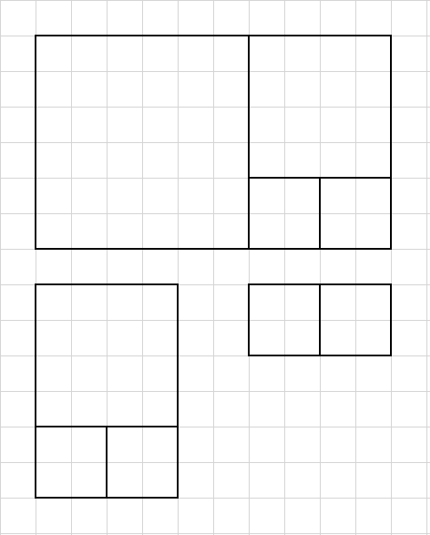
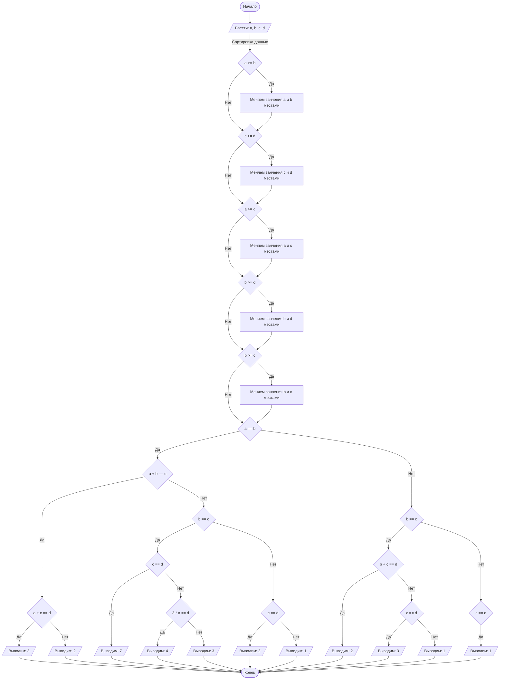

## Отчет по лабораторной работе № 1


#### № группы: `ПМ-2401`

#### Выполнил: `Данилов Денис Юрьевич`

#### Вариант: `11`

### Содержание:

- [Постановка задачи](#1-постановка-задачи)
- [Входные и выходные данные](#2-входные-и-выходные-данные)
- [Выбор структуры данных](#3-выбор-структуры-данных)
- [Алгоритм](#4-алгоритм)
- [Программа](#5-программа)
- [Анализ правильности решения](#6-анализ-правильности-решения)

### 1. Постановка задачи

> На вход программы подаются четыре различных квадрата с длинами сторон A, B, C, D. 
> Определить, сколько можно сложить прямоугольников, используя хотя бы 2 квадрата без 
> наложений и зазоров. На вход программы подаются натуральные числа A, B, C, D.

Эту задачу можно разделить на 2 подзадачи: cортировка квадратов (по возрастанию или по убыванию) 
и проверка различных условий, при которых можно составить прямоугольники. Также будем считать, что на вход могут 
подаваться одинаковые длины квадратов, так как из разных, несовпадающих, квадратов составить 
прямоугольник не получится. 

Например, пусть нам даны квадраты со сторонами 6, 4, 2, 2. Можно составить 3 прямоугольника (2х2 + 2х2, 2x2 + 2x2 + 4x4,
2x2 + 2x2 + 4x4 + 6x6).



### 2. Входные и выходные данные

#### Данные на вход

На вход программы подаются 4 натуральных числа. Значит на вход мы должны принимать целые 
числа, у которых есть нижняя граница равная 1. При этом будем считать, что эти числа могут совпадать,
так как, если все числа будут различны, мы не сможем составить прямоугольники ни из 2, ни из 3, 
ни из 4 квадратов. Хотя бы 2 квадрата должны совпадать. 

|             | Тип         | min значение |
|-------------|-------------|--------------|
| A (Число 1) | Целое число | 1            |
| B (Число 2) | Целое число | 1            |
| C (Число 3) | Целое число | 1            |
| D (Число 4) | Целое число | 1            |

#### Данные на выход

Т.к. программа должна вывести количество прямоугольников, то на выход мы получим 
одно целое неотрицательное число.

|         | Тип         | min значение |
|---------|-------------|--------------|
| Число 1 | Целое число | 0            |


### 3. Выбор структуры данных

Программа получает на вход 4 целых числа, которые больше 1. Поэтому для хранения данных выделим 
4 переменных (`a`, `b`, `c` и `d`) типа `int`.

|             | название переменной | Тип (в Java) |
|-------------|---------------------|--------------|
| A (Число 1) | `a`                 | `int`        |
| B (Число 2) | `b`                 | `int`        |
| С (Число 3) | `c`                 | `int`        |
| В (Число 4) | `d`                 | `int`        |

Хранение результата программы не требуется.

### 4. Алгоритм

#### Алгоритм выполнения программы

1. **Ввод данных:**  
   Программа считывает четыре целых числа `a`, `b`, `c` и `d`.

2. **Сортировка:**  
   Программа сортирует числа `a`, `b`, `c` и `d` в порядке возрастания.

3. **Проверка совпадения квадратов и других условий для нахождения числа прямоугольников:** 
   - 7 прямоугольников: *можно получить, когда все квадрата равны.*
   - 4 прямоугольника: *можно составить, когда равны 3 маленьких квадрата и сумма их сторон равна стороне 
   самого большого квадрата.*
   - 3 прямоугольника: *1) Если равны два маленьких квадрата, а сумма их сторон равна среднему квадрату.
   Также сумма стороны среднего и маленького квадратов, в свою очередь, равна стороне большого квадрата. 2) Если равны три 
   маленьких квадрата и сумма их стороны не равна стороне большого квадрата или когда равны три больших квадрата.*
   - 2 прямоугольника: *1) Если равны два больших и два маленьких квадрата. 2) Если равны два маленьких квадрата, 
   а сумма их стороны равна среднему квадрату. Но сумма сторон среднего и маленького квадратов не равны стороне большого. 3) Если
   равны два средних квадрата, а сумма их сторон равна стороне большого квадрата.*
   - 1 прямоугольник: *если равны два больших квадрата, или равны два средних квадрата, или равны два маленьких квадрата,
   и при этом не выполнены выше изложенные условия.*
   - 0 прямоугольников: *если нет равных квадратов.*

4. **Вывод результата**  
На экран выводится количество составленных прямоугольников.

#### Блок-схема



### 5. Программа

```java
import java.util.Scanner;
import java.io.PrintStream;

public class Main {
   // Объявляем объект класса Scanner для ввода данных
   public static Scanner in = new Scanner(System.in);
   // Объявляем объект клсса PrintStream для вывода данных
   public static PrintStream out = System.out;

   public static void main(String[] args) {
      // Считывание четырех целых чисел a, b, c и d.
      int a = in.nextInt();
      int b = in.nextInt();
      int c = in.nextInt();
      int d = in.nextInt();

      // swap - это переменная для хранения временных данных во время замены значений
      int swap;
      // сортировка с использованием сортировочной сети
      if (a >= b) {
         swap = a;
         a = b;
         b = swap;
      }
      if (c >= d) {
         swap = c;
         c = d;
         d = swap;
      }
      if (a >= c) {
         swap = a;
         a = c;
         c = swap;
      }
      if (b >= d) {
         swap = b;
         b = d;
         d = swap;
      }
      if (b >= c) {
         swap = b;
         b = c;
         c = swap;
      }

      // Проверка, когда два самых маленьких квадрата равны.
      if (a == b) {
         // Расмотрение случаев, когда сумма стороны двух маленьких квадратов равна стороне среднего.
         if (a + b == c) {
            // И если при этом сумма длин сторон маленького и среднего квадратов
            // равны большому, то получится сложить 3 прямоугольника. Иначе получим
            // только 2 прямоугольника.
            if (a + c == d)
               out.println(3);
            else
               out.println(2);
         } else if (b == c) {
            // Если равны все четыре квадрата, то можно получить 7 прямоугольников.
            if (c == d)
               out.println(7);
               // Если равны три квадрата и сумма их сторон равна стороне самого большого квадрата,
               // то можно получить 4 прямоугольника. Иначе только 3.
            else if (3 * a == d)
               out.println(4);
            else
               out.println(3);
            // Если равны два маленьких квадрата и два больших, то можно сложить 2 прямоугольника.
         } else if (c == d) {
            out.println(2);
            // Если не выполнилось ни одно условие, то можно получить 1 прямоугольник.
         } else
            out.println(1);
         // Теперь посмотрим на случаи, когда равны два средних квадрата.
      } else if (b == c) {
         // Если сумма сторон двух средних квадратов равна стороне самого большого квадрата,
         // то можно получить 2 прямоугольника.
         if (b + c == d) {
            out.println(2);
            // Если равны три больших квадрат, то можно сложить 3 прямоугольника.
         } else if (c == d) {
            out.println(3);
            // Если ничего не выполнилось, то всего 1 прямоугольник.
         } else
            out.println(1);
         // Если равны два больших квадрата, то можно сложить всего 1 прямоугольник. Случай, когда равны 2 больших
         // и 2 маленьких мы уже рассмотрели.
      } else if (c == d) {
         out.println(1);
         // Если нет равных квадратов, то не получится сложить ни один прямоугольник.
      } else {
         out.println(0);
      }
   }
}
```

### 6. Анализ правильности решения

1. Тест при разных `a`, `b`, `c` и `d`:
   
   - **Input**:
      ```
     15 12 21 14
     ```
     
   - **Output**:
      ```
     0
     ```

2. Тест, когда равны два квадрата, а остальные разные:

   - **Input**:
      ```
     14 52 32 14
     ```

   - **Output**:
      ```
     1
     ```

3. Тест, когда равны два маленьких квадрата и сумма длины их сторон равна стороне среднего квадрата, a сумма 
длины стороны среднего и маленького квадратов равна стороне большого квадрата:

   - **Input**:
      ```
     9 18 27 9
     ```

   - **Output**:
      ```
     3
     ```

4. Тест, когда равны два маленьких квадрата и сумма длины их сторон равна стороне среднего квадрата:

   - **Input**:
      ```
     11 42 11 22
     ```

   - **Output**:
      ```
     2
     ```
     
5. Тест, когда равны три квадрата и сумма их сторон равна стороне самого большого квадрата:

   - **Input**:
      ```
     43 43 129 43
     ```

   - **Output**:
      ```
     4
     ```
     
6. Тест, когда равны два маленьких и два больших квадрата:

   - **Input**:
      ```
     32 12 32 12
     ```

   - **Output**:
      ```
     2
     ```
     
7. Тест, когда равны два средних квадрата и сумма сторон двух средних квадратов равна стороне самого большого квадрата:

   - **Input**:
      ```
     4 7 14 7
     ```

   - **Output**:
      ```
     2
     ```

8. Тест, когда равны три квадрат:

   - **Input**:
      ```
     19 19 3 19
     ```

   - **Output**:
      ```
     3
     ```
     
9. Тест, когда равны все квадраты:
   - **Input**:
      ```
     52 52 52 52
     ```

   - **Output**:
      ```
     7
     ```